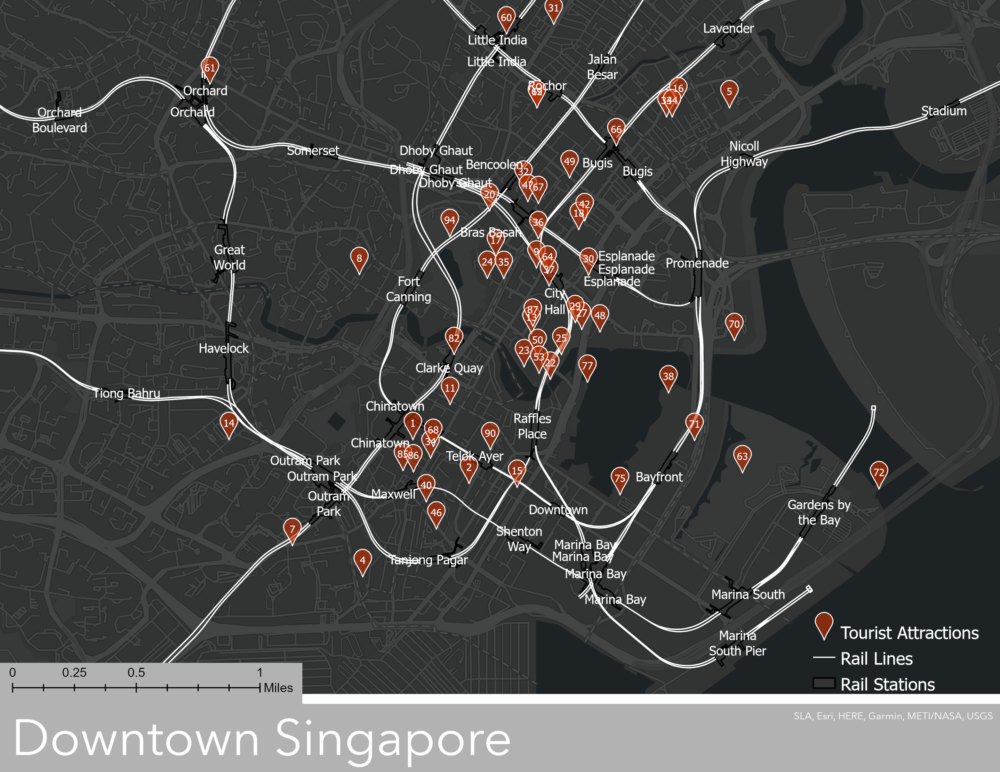

# ArcGIS Pro 101 | Singapore Tourism

Learn ArcGIS through projects available on ArcGIS website.

## Requirements

- ArcGIS Pro (get [free](https://www.esri.com/en-us/lg/training-and-services/learn-arcgis-education-trial) trial)

## References

- Singapore Tourism Project ([Link](https://learn.arcgis.com/en/projects/get-started-with-arcgis-pro/))
- Singapore Database ([Link](https://www.arcgis.com/home/item.html?id=b6c521bf02fc46b8887c7af0d071b483))

## Snapshot Summary

